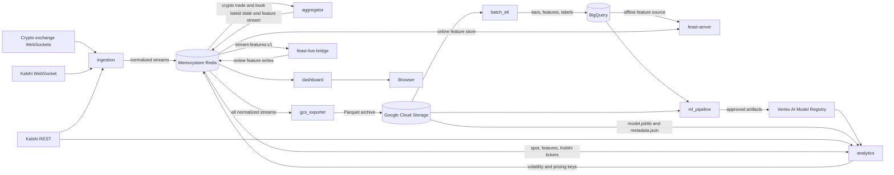

# System architecture

This document describes the service boundaries and interfaces implemented in
this repository. It treats Redis streams, Redis keys, cloud datasets, and HTTP
endpoints as APIs because they are the contracts through which independently
deployed components exchange data.

## Architecture at a glance

The system has two connected paths:

- The **real-time path** ingests exchange events, derives current market state,
  computes volatility and Kalshi prices, and renders the dashboard.
- The **offline path** archives the same normalized events, creates historical
  features and labels, trains models, and registers approved artifacts for the
  real-time analytics service.

There is no synchronous service-to-service RPC on the main real-time path.
Redis is the integration boundary. HTTP servers are used for health checks,
the dashboard UI, and the optional Feast feature-serving API.

## Service responsibilities

| Service | Exact responsibility | Explicitly does not own |
|---|---|---|
| `ingestion` | Connect to supported venue feeds, normalize external messages into versioned crypto/Kalshi events, and publish each event durably to Redis Streams before a best-effort Pub/Sub notification. | Aggregation, historical storage, feature computation, pricing, trading decisions. |
| `aggregator` | Consume normalized crypto trades/books; maintain per-venue state; publish a fee-adjusted aggregated book, equal-weight fresh-venue spot price, 10-second candles, CVD, and the live v1 feature envelope. | Exchange connectivity, Kalshi pricing, Feast SDK writes, durable archival. |
| `gcs_exporter` | Consume five normalized Redis Streams with independent consumer groups and archive validated batches as create-only Snappy Parquet objects in GCS; ACK only after verified upload. | Resampling, feature formulas, model training, dashboard state. |
| `batch_etl` | Land archived raw data in BigQuery, resample canonical bars, and calculate historical realized-volatility features and future-volatility labels on hourly schedules. | Live aggregation, Feast registry ownership, model selection or serving. |
| `feast_store` | Own Feast entities, data sources, FeatureViews, FeatureServices, registry application, historical point-in-time retrieval configuration, live feature validation, and online-store writes. | Feature formulas, model training, analytics pricing. |
| `ml_pipeline` | Load point-in-time training data, train five horizon models, compare candidates with benchmark/champion metrics, and register promoted artifacts in Vertex AI. | Raw ingestion, label generation, live inference, order execution. |
| `analytics` | Load exactly five configured Vertex/GCS model bundles, consume current spot/features and Kalshi tickers, obtain authoritative Kalshi market metadata, calculate volatility term structure and quote-relative probabilities/edges, and publish fresh pricing state. | Orders, positions, execution, upstream schema changes, fallback forecasts. |
| `dashboard` | Poll Redis read models, join analytics prices to Kalshi contracts, and render the operator-facing Dash UI. | Transforming producer schemas, calculating forecasts, persisting source-of-record data. |

## Interface catalog

### External APIs consumed

| External API | Protocol and endpoint | Consumer | Purpose |
|---|---|---|---|
| Binance Spot | WebSocket combined trade and partial-depth feed | `ingestion` | BTCUSDT trades and top-of-book snapshots. |
| Gemini Spot | `wss://ws.gemini.com` | `ingestion` | BTCUSD trades and depth. |
| Crypto.com Exchange | `wss://stream.crypto.com/exchange/v1/market` | `ingestion` | BTC_USD trades and books. |
| Bitstamp | `wss://ws.bitstamp.net` | `ingestion` | BTCUSD trades and books. |
| Coinbase Advanced Trade | `wss://advanced-trade-ws.coinbase.com` | `ingestion` | Authenticated BTC-USD trades and level-2 books. |
| Deribit JSON-RPC | `wss://www.deribit.com/ws/api/v2` | `ingestion` | BTC_USDT spot trades. |
| Kraken v2 | `wss://ws.kraken.com/v2` | `ingestion` | BTC/USD trades and books. |
| Kalshi market data | `wss://external-api-ws.kalshi.com/trade-api/ws/v2` | `ingestion` | KXBTCD ticker, trade, and order-book events. |
| Kalshi market discovery | `GET /trade-api/v2/events`; fallback `GET /trade-api/v2/markets` on `https://external-api.kalshi.com` | `ingestion`, `analytics` | Discover active KXBTCD events/markets; analytics also obtains strike, close time, and settlement semantics. |
| GCS JSON/API | Project bucket, currently `gs://kalshi-crypto-tick-data` | `gcs_exporter`, `batch_etl`, `ml_pipeline`, `analytics`, Feast registry | Archive, batch input/output, model artifacts, pipeline artifacts, and Feast registry. |
| BigQuery API | `market_data`, `feature_store`, and `training_labels` datasets | `batch_etl`, `feast_store`, `ml_pipeline` | Canonical bars, offline features, labels, and point-in-time training reads. |
| Vertex AI API | Regional model registry and pipeline APIs | `ml_pipeline`, `analytics` | Register approved models and resolve exact model resources/artifact URIs. |

The repository contains a Bybit adapter and configuration fields, but
`IngestionService` does not currently instantiate it. Bybit is therefore not an
active production input and is also excluded from aggregation/export defaults.

### Redis Streams

Streams are durable, ordered APIs. Each durable consumer owns its own consumer
group, so one consumer's ACK does not remove another consumer's work.

| Stream | Producer | Consumers and consumer groups | Contract |
|---|---|---|---|
| `stream:ticks` | `ingestion` | `aggregator` (`market_aggregator_trades`); `gcs_exporter` (`gcs_archiver_group`) | Normalized crypto trades. |
| `stream:orderbook_snapshots` | `ingestion` | `aggregator` (`market_aggregator_books`); `gcs_exporter` (`gcs_orderbook_archiver_group`) | Normalized crypto book snapshots. |
| `stream:kalshi_tickers` | `ingestion` | `analytics` (`analytics-pricing-v1`); `gcs_exporter` (`gcs_kalshi_ticker_archiver_group`); `dashboard` via bounded reverse reads without a group | Normalized Kalshi ticker updates. |
| `stream:kalshi_trades` | `ingestion` | `gcs_exporter` (`gcs_kalshi_trade_archiver_group`); `dashboard` via bounded reverse reads without a group | Normalized Kalshi trades. |
| `stream:kalshi_orderbook` | `ingestion` | `gcs_exporter` (`gcs_kalshi_orderbook_archiver_group`) | Normalized Kalshi order-book snapshots/deltas. |
| `stream:features:v1` | `aggregator` | `feast-live-bridge` (`feast-live-features-v1`) | Versioned live `market_features` envelope containing `synthetic_price`, `log_return`, and `venue_count`. |
| `stream:pricing:v1` | `analytics` | No in-repository durable consumer currently | Audit/event stream of available analytics price publications. |

The aggregator defaults still use the historical Redis group IDs
`market_aggregator_books` and `market_aggregator_trades`. These are persistent
stream-delivery identities, not service names; changing them during the rename
would create new groups and could replay historical events. Deployed manifests
may override them with an explicitly versioned group such as
`aggregator_books_v3`.

`gcs_exporter` starts archival consumer groups at `0` and reclaims abandoned
pending entries. The aggregator's group start is configurable. The Feast bridge
starts at `$` for new live features and reclaims its own pending entries.
Analytics bootstraps recent Kalshi tickers with `XREVRANGE`, then uses its group
and `XAUTOCLAIM` for recovery.

### Redis latest-state and collection APIs

| Key or pattern | Type / retention | Producer | Consumer |
|---|---|---|---|
| `market:book:BTCUSDT:latest` | JSON string, replaced in place | `aggregator` | `dashboard` |
| `market:spot:BTCUSDT:latest` | JSON string, replaced in place | `aggregator` | `analytics`, `dashboard` |
| `market:candle_state:BTCUSDT:10s` | JSON string, replaced in place | `aggregator` | `aggregator` restart recovery |
| `market:candles:BTCUSDT:10s` | JSON array, replaced in place | `aggregator` | `dashboard`; aggregator fallback recovery |
| `market:cvd:BTCUSDT:10s` | JSON array, replaced in place | `aggregator` | `dashboard` |
| `market:features:v1:BTCUSD:latest` | Versioned JSON, 120-second TTL | `aggregator` | `analytics` |
| Feast online-store keys | Feast-managed Redis representation | `feast-live-bridge`; Feast materialization jobs | `feast-server`; future Feast SDK clients |
| `market:volatility:v1:BTCUSD:latest` | Versioned JSON, 60-second TTL | `analytics` | Operations/smoke checks; future consumers |
| `market:pricing:v1:<market_ticker>` | Available-price JSON, 60-second TTL | `analytics` | `dashboard` |
| `market:pricing:v1:status:<market_ticker>` | Unavailable diagnostic JSON, 60-second TTL | `analytics` | Operations/diagnostics |
| `market:pricing:v1:active` | Sorted set scored by generation time | `analytics` | `analytics` cleanup; operations |

The dashboard joins `market:pricing:v1:<market_ticker>` onto contract rows at
read time. It does not require changes to ingestion or aggregator payloads.

### Redis Pub/Sub channels

Pub/Sub is best-effort and is not used for recovery. There are currently no
required in-repository Pub/Sub consumers; durable consumers use Streams or
latest-state keys.

| Channel | Producer | Payload |
|---|---|---|
| `pub:btc_ticks` | `ingestion` | Normalized crypto trade. |
| `pub:orderbook` | `ingestion` | Normalized crypto book snapshot. |
| `pub:kalshi_tickers` | `ingestion` | Normalized Kalshi ticker. |
| `pub:kalshi_trades` | `ingestion` | Normalized Kalshi trade. |
| `pub:kalshi_orderbook` | `ingestion` | Normalized Kalshi book update. |
| `market:aggregated_orderbook` | `aggregator` | Aggregated book snapshot. |
| `market:aggregated_spot` | `aggregator` | Synthetic spot snapshot. |
| `market:aggregated_candles` | `aggregator` | Current candle array. |
| `market:aggregated_cvd` | `aggregator` | Current CVD array. |
| `pub:features:v1` | `aggregator` | Versioned live feature envelope. |
| `pub:pricing:v1` | `analytics` | Available analytics price publication. |

### HTTP APIs exposed by repository services

| Service | Endpoint | Exposure | Consumer |
|---|---|---|---|
| `aggregator` | `GET /healthz` on `8080` | Pod-local health server; no Kubernetes Service | Kubernetes startup/liveness probes. |
| `aggregator` | `GET /readyz` on `8080` | Pod-local health server | Kubernetes readiness probe; ready after Redis and consumer groups are available. |
| `gcs_exporter` | `GET /healthz`, `GET /readyz` on `8080` | Pod-local health server; no Kubernetes Service | Kubernetes probes for the primary trade exporter. Internal sibling exporters use ports `8081` through `8084`. |
| `analytics` | `GET /healthz` on `8080` | `ClusterIP` Service `analytics:8080` | Kubernetes probes and deployment smoke checks. |
| `analytics` | `GET /readyz` on `8080` | `ClusterIP` Service `analytics:8080` | Kubernetes/CD; ready only after models load and a supported market has a fresh published price. |
| `feast-server` | Feast HTTP feature server on `feast-server:6566` | Internal `ClusterIP` | No current in-repository runtime caller. Available for future online feature clients. |
| `dashboard` | Dash UI at `/` on `dashboard:8050` | Internal `ClusterIP` | Operator browser through an approved access layer. |
| `dashboard` | `GET /healthz`, `GET /readyz` on `8050` | Internal `ClusterIP` | Kubernetes probes; readiness checks Redis connectivity. |
| `ingestion` | None | Not applicable | Process health is currently inferred from pod/process state and logs. |
| `batch_etl` | None | Not applicable | Scheduled Kubernetes Jobs. |
| `feast-live-bridge` | None | Not applicable | Long-running stream worker. |
| `ml_pipeline` | None | Not applicable | Vertex/Kubeflow task containers and submission scripts. |

### Cloud storage and data APIs

| Resource | Writer/owner | Readers | Purpose |
|---|---|---|---|
| `gs://<bucket>/ticks/venue=.../instrument=.../date=.../hour=.../*.parquet` | `gcs_exporter` | `batch_etl` | Raw crypto trade archive. |
| `gs://<bucket>/books/venue=.../instrument=.../date=.../hour=.../*.parquet` | `gcs_exporter` | `batch_etl` | Raw crypto book archive. |
| `gs://<bucket>/kalshi/{tickers,trades,orderbooks}/series=.../event=.../market=.../instrument=.../date=.../hour=.../*.parquet` | `gcs_exporter` | Offline analysis/backfills | Raw Kalshi archive. |
| `gs://<bucket>/dead-letter/stream=.../*.json` | `gcs_exporter` | Operations | Malformed stream entries retained before ACK. |
| `gs://<bucket>/processed/resampled_market_data/...` | `batch_etl` | Legacy/rollback loaders and offline analysis | Canonical resampled Parquet path. |
| `gs://<bucket>/features/v1/...` | `batch_etl` | Legacy ML loader/offline analysis | Historical feature Parquet path. |
| `gs://<bucket>/feature_store/registry.db` | Feast apply job | `feast-live-bridge`, `feast-server`, `ml_pipeline` | Feast registry. |
| Immutable model artifact prefixes containing `model.joblib` and `metadata.json` | `ml_pipeline` or approved bootstrap process | `analytics` | Exact model bytes and ordered feature metadata. |
| `market_data.bars` | `batch_etl` | Feature/label SQL | Canonical multi-frequency BigQuery bars. |
| `feature_store.realized_volatility_v1` | `batch_etl` | Feast offline store, `ml_pipeline` | Point-in-time historical BTC features. |
| `training_labels.future_realized_volatility_v1` | `batch_etl` | `ml_pipeline` | Forward realized-volatility labels for 1m, 5m, 15m, 30m, and 1h horizons. |
| Vertex model resources | `ml_pipeline` registration stage/operator-approved bootstrap | `analytics` | Immutable model identity and artifact URI lookup. |

## End-to-end flows

### Live crypto market state

1. `ingestion` opens venue WebSockets and converts messages to canonical v1
   trade or book events.
2. It appends each event to `stream:ticks` or
   `stream:orderbook_snapshots`; Pub/Sub follows only as a best-effort signal.
3. `aggregator` reads both streams through independent consumer groups.
4. It updates the latest aggregated book and, on trades, the synthetic spot,
   candles, CVD, and live feature envelope.
5. `dashboard` polls the latest book/spot/candle/CVD keys. `analytics` reads the
   latest spot and feature keys.

### Live Kalshi pricing

1. `ingestion` discovers the active `KXBTCD` event set through Kalshi REST,
   subscribes over Kalshi WebSocket, and publishes ticker/trade/book events to
   their three Redis Streams.
2. `analytics` bootstraps and consumes `stream:kalshi_tickers`, while separately
   refreshing authoritative event/market metadata through Kalshi REST.
3. For each fresh supported contract, analytics reads the latest BTC spot and
   v1 live features, executes all five loaded volatility models, and computes
   the model probability and quote-relative edges.
4. Analytics publishes the term structure and per-market pricing keys with
   short TTLs. Stale or invalid dependencies remove the available price and
   produce a short-lived status record instead of a fabricated fallback.
5. `dashboard` reads recent Kalshi ticker/trade stream entries, selects the ATM
   contract window, and attaches fresh analytics keys by market ticker.

### Archive, features, labels, and models

1. `gcs_exporter` independently consumes the five normalized ingestion streams.
2. It validates and buffers records, uploads partitioned Parquet objects to GCS,
   verifies the upload, then ACKs Redis entries. This gives at-least-once archive
   delivery; downstream readers deduplicate by `event_id` or `redis_id`.
3. The hourly `batch-etl` CronJob lands the preceding raw hour and resamples it
   into `market_data.bars` at `1s`, `5s`, `1m`, `5m`, `10m`, `30m`, and `1h`.
4. The feature job derives historical v1 features from 1-minute bars. The label
   job runs with a delay so future windows are complete before it writes labels.
5. `ml_pipeline` retrieves labels from BigQuery and point-in-time features
   through the Feast repository, trains one XGBoost model per horizon, evaluates
   candidates, and registers approved artifacts in Vertex AI.
6. Deployment supplies analytics with five exact Vertex resource names.
   Analytics resolves each resource's GCS URI and downloads the corresponding
   `model.joblib` and `metadata.json` at startup.

### Feast offline and online paths

- **Offline:** BigQuery `feature_store.realized_volatility_v1` is the Feast
  source used for historical point-in-time retrieval by `ml_pipeline`.
- **Online:** `aggregator` emits `stream:features:v1`; the Feast live
  bridge validates its immutable feature contract and pushes it to the Feast
  Redis online store.
- **Serving:** `feast-server:6566` exposes the online store through Feast's HTTP
  API. It is available but not used by the current analytics implementation.
- **Analytics fast path:** analytics reads
  `market:features:v1:BTCUSD:latest` directly. This is intentional and keeps the
  pricing service compatible with the existing low-latency Redis architecture
  without forcing Feast or upstream producers to change.

## Deployment topology and ownership rules

- Long-running workloads in GKE: `ingestion-service`, `aggregator`,
  `gcs-exporter`, `feast-live-bridge`, `feast-server`, `analytics`, and
  `dashboard`.
- Scheduled workloads in GKE: `batch-etl`, `batch-etl-features`, and
  `batch-etl-targets` CronJobs; Feast repository application is a one-shot Job.
- `dashboard`, `analytics`, and `feast-server` use internal `ClusterIP` Services.
  Nothing in these manifests creates a public endpoint.
- Ingestion remains single-replica to avoid duplicate exchange subscriptions.
  Stateful stream workers use distinct Redis consumer groups for independent
  delivery and recovery.
- Producers own schemas and write APIs. Consumers must adapt to current
  versioned contracts rather than requiring unrelated services to change.
- `analytics` is read-only toward upstream contracts and has no execution
  authority. A future order-execution service must be a separate ownership and
  permission boundary.

## Current intentional boundaries and known gaps

- The Bybit adapter is present but dormant; enabling it requires explicitly
  wiring it into `IngestionService` and deciding whether it joins aggregation
  and archival venue allowlists.
- Feast Server has no current runtime consumer inside this repository.
- `stream:pricing:v1` and the Redis Pub/Sub channels have no required consumers;
  they are extension/audit interfaces, not hidden dependencies.
- The dashboard is internal-only. Public access requires a separately approved
  authenticated ingress or tunnel.
- Analytics requires all five model artifacts. It deliberately remains not
  ready if any model, live feature, spot input, Kalshi metadata, or permission is
  unavailable.
