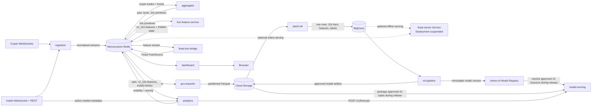

# System architecture

This is the current contract map for the deployed system. Redis Streams,
latest-state keys, HTTP endpoints, BigQuery tables, and GCS object layouts are
APIs: producers own their schemas and consumers adapt at their own boundary.
No service is required to change its payload merely to simplify a downstream
consumer.

## End-to-end data flow

The real-time path is asynchronous through Redis except for the bounded
`analytics -> model-serving` HTTP call. Feast is deliberately outside that
synchronous pricing path; it provides contract registration, offline retrieval,
online reconciliation, and parity checks.

## Service responsibilities

| Service | Owns | Does not own |
|---|---|---|
| `ingestion` | Exchange connectivity, Kalshi discovery/subscriptions, event normalization, durable Redis Stream publication, best-effort Pub/Sub notification. | Aggregation, feature computation, archival, inference, pricing. |
| `aggregator` | Crypto stream consumption, per-venue freshness, canonical per-venue book publication, equal-weight fresh-venue spot, completed 10-second per-venue primitives, 30-second dashboard candles, restart checkpoints. | Venue connections, model features, forecasts, Kalshi pricing, archival. |
| `live_feature_service` | Rolling primitive history, `market_features/v2_10s` calculation, EWMA variance state, atomic checkpoint/output/ACK, restart replay. | Raw exchange parsing, Feast registry changes, model inference. |
| `gcs_exporter` | Independent archival of five normalized source streams, validation, create-only Parquet uploads, dead letters, ACK after verified storage. | Aggregation, resampling, features, training. |
| `batch_etl` | GCS-to-BigQuery landing, canonical 10-second bars, offline v2_10s features, future-volatility labels (legacy 1m plus four active horizons), idempotent hourly jobs and backfills. | Live state, Feast definitions, model selection or serving. |
| `feast_store` | Immutable feature specifications, Feast entities/sources/views/services, registry apply, online push/materialization, historical retrieval configuration, offline/online parity checks. | Feature formulas, labels, model training, pricing. |
| `ml_pipeline` | Point-in-time-safe training data assembly, chronological training/evaluation for 5m/15m/30m/1h, EWMA comparison, promotion decision, Vertex registration. | Feature generation, online inference, pricing. |
| `model_serving` | Validation and serving of a complete four-horizon forecast. Production uses packaged EWMA for 5m/15m/30m and an immutable promoted XGBoost artifact for 1h. | Redis/Feast access, Kalshi metadata, probability/edge calculation, public access. |
| `analytics` | Live dependency freshness, Kalshi market metadata, forecast API adaptation, linear annualized-volatility interpolation, KXBTCD midpoint IV, above-strike probability, fair value and quote edges, fail-closed publication. | Model training, feature computation, UI, orders or positions. |
| `dashboard` | Read-only Redis polling, KXBTCD contract selection, analytics-key join, browser rendering, Redis readiness. | Producer schema transformation, forecasts, pricing, durable storage. |

## API and interface catalog

### External APIs

| API | Consumer | Use |
|---|---|---|
| Binance, Gemini, Crypto.com, Bitstamp, Coinbase Advanced Trade, Deribit, and Kraken WebSockets | `ingestion` | Live BTC trades and supported order-book snapshots. |
| Kalshi REST `/trade-api/v2/events` with markets fallback | `ingestion`, `analytics` | Active KXBTCD discovery; analytics additionally resolves strike, expiry, and status. |
| Kalshi WebSocket `/trade-api/ws/v2` | `ingestion` | KXBTCD ticker, trade, and order-book updates. |
| Google Cloud Storage API | `gcs_exporter`, `batch_etl`, `feast_store`, `ml_pipeline`, release CI | Raw archive, processed data, Feast registry, pipeline/model artifacts, release-time model packaging. |
| BigQuery API | `batch_etl`, `feast_store`, `ml_pipeline` | Canonical bars, offline features, labels, and training reads. |
| Vertex AI Pipelines and Model Registry | `ml_pipeline`, release CI | Run training DAGs, register model versions, and resolve the approved 1h artifact. |

The repository has a Bybit adapter and configuration fields, but
`IngestionService` does not instantiate it. Bybit is not a production input.

### Redis Streams

| Stream | Producer | Consumers |
|---|---|---|
| `stream:ticks` | `ingestion` | `aggregator` group `aggregator_trades_v5`; `gcs_exporter` group `gcs_archiver_group` |
| `stream:orderbook_snapshots` | `ingestion` | `aggregator` group `aggregator_books_v5`; `gcs_exporter` group `gcs_orderbook_archiver_group` |
| `stream:kalshi_tickers` | `ingestion` | `analytics` group `analytics-pricing-v1`; `gcs_exporter`; `dashboard` bounded reverse reads |
| `stream:kalshi_trades` | `ingestion` | `gcs_exporter`; `dashboard` bounded reverse reads |
| `stream:kalshi_orderbook` | `ingestion` | `gcs_exporter` |
| `stream:orderbook:v1` | `aggregator` | No durable in-repository consumer; audit/future integration boundary |
| `stream:primitives:v1` | `aggregator` | `live_feature_service` group `live-features-v2-10s` |
| `stream:features:v2_10s` | `live_feature_service` | `feast-live-bridge`; parity job reads bounded history |
| `stream:pricing:v1` | `analytics` | No durable in-repository consumer; bounded audit history |

Consumer-group names are persistent delivery identities. Production pins the
aggregator's `aggregator_*_v5` groups. Historical `market_aggregator_*` values
remain code defaults for compatibility, not the deployed delivery identities.

### Redis latest-state keys

| Key or pattern | Producer | Consumers |
|---|---|---|
| `market:book:BTCUSDT:latest` | `aggregator` | Most recent canonical per-venue book; operational tools and legacy dashboard reader |
| `market:spot:BTCUSDT:latest` | `aggregator` | `analytics`, `dashboard` |
| `market:candles:BTCUSDT:30s` | `aggregator` | `dashboard` |
| `market:candle_state:BTCUSDT:10s` and `market:primitive_watermark:BTCUSDT:10s` | `aggregator` | `aggregator` restart recovery |
| `market:primitive:<venue>:10s:latest` | `aggregator` | Diagnostics |
| `market:features:v2_10s:BTCUSD:latest` | `live_feature_service` | `analytics`, parity/operations |
| `market:features:BTCUSD:state:v2_10s` | `live_feature_service` | `live_feature_service` restart recovery |
| Feast-managed Redis keys | `feast-live-bridge`, Feast materialization jobs | Future Feast clients; HTTP server is currently suspended |
| `market:volatility:v2_10s:BTCUSD:latest` | `analytics` | Deployment smoke checks and operations |
| `market:implied_volatility:v1:BTCUSD:latest` | `analytics` | `dashboard` volatility cone and operations |
| `market:pricing:v1:<ticker>` | `analytics` | `dashboard` |
| `market:pricing:v1:status:<ticker>` | `analytics` | Operations and diagnostics |
| `market:pricing:v1:active` | `analytics` | `analytics` cleanup and operations |

Feature, volatility, price, and status snapshots have bounded freshness or TTL
semantics. Consumers must validate timestamps; key existence alone is not proof
that data is usable.

### Redis Pub/Sub

`ingestion` emits best-effort notifications on `pub:btc_ticks`,
`pub:orderbook`, `pub:kalshi_tickers`, `pub:kalshi_trades`, and
`pub:kalshi_orderbook`. `aggregator` publishes
`market:aggregated_spot` and `market:aggregated_candles`; `analytics`
publishes `pub:pricing:v1`. No required in-repository recovery path relies on
Pub/Sub.

### HTTP APIs

| Service | Endpoint | Consumer/exposure |
|---|---|---|
| `model-serving` | `GET /healthz`, `GET /readyz`, `POST /v1/forecast` on 8080 | Internal ClusterIP `model-serving:8080`; analytics is the business caller, Kubernetes uses probes. |
| `analytics` | `GET /healthz`, `GET /readyz` on 8080 | Internal ClusterIP `analytics:8080`; Kubernetes and deployment smoke checks. |
| `dashboard` | Dash UI `/`, `GET /healthz`, `GET /readyz` on 8050 | ClusterIP `dashboard:8050`; GCE Ingress exposes `crypto-dashboard.kairos-trading.com`. |
| `feast-server` | Feast HTTP Service on 6566 | Compatibility Service retained, but its Deployment has zero replicas and no active callers. |
| `aggregator`, `live-feature-service`, `gcs-exporter` | `GET /healthz`, `GET /readyz` on pod-local probe ports | Kubernetes only; no Service object. |
| `ingestion`, `batch_etl`, `ml_pipeline`, `feast-live-bridge` | No application HTTP API | Process/Job state and logs provide health. |

The forecast request contains `market_features/v2_10s`, event and availability
timestamps, feature values, source timestamps, and EWMA state. A successful
response contains exactly `5m`, `15m`, `30m`, and `1h`, plus model
resources/version and inference timestamps. Invalid or stale requests return a
4xx response; incomplete internal results return 5xx.

### Cloud data contracts

| Resource | Writer | Readers |
|---|---|---|
| `gs://<bucket>/ticks/...`, `books/...`, `kalshi/{tickers,trades,orderbooks}/...` Parquet | `gcs_exporter` | `batch_etl`, offline analysis |
| `gs://<bucket>/dead-letter/stream=.../*.json` | `gcs_exporter` | Operations |
| `market_data.raw_ticks`, `market_data.raw_orderbooks`, `market_data.bars` | `batch_etl` | Feature/label SQL and offline analysis |
| `feature_store.realized_volatility_v2_10s` | `batch_etl` | Feast offline source, `ml_pipeline` |
| `feature_store.realized_volatility_v3_10s` | `batch_etl` | Feast offline source and HAR research/training |
| `training_labels.future_realized_volatility_v2_10s` | `batch_etl` | `ml_pipeline` |
| `gs://<bucket>/feature_store/registry.db` | Feast apply job | Feast bridge/server and ML loaders |
| Immutable `model.joblib` + `metadata.json` artifact | `ml_pipeline` promotion | Release CI packages approved 1h bytes |
| Versioned Vertex model resource | `ml_pipeline` registration | Release CI resolves exact approved 1h resource |

## Runtime and release boundaries

Production runs in GKE `quant-cluster` in `asia-northeast3`. Long-running
Deployments are `ingestion-service`, `aggregator`, `gcs-exporter`,
`live-feature-service`, `feast-live-bridge`, `model-serving`, `analytics`, and
`dashboard`. The `feast-server` Deployment and Service remain as a reversible
compatibility shell, with the Deployment intentionally set to zero replicas.
Batch bars, features, targets, Feast apply/materialization, and feature parity
run as Jobs or CronJobs. ML training executes as Vertex AI Pipeline components.

CD packages the immutable promoted 1h artifact into the model-serving image.
The running model-serving pod therefore does not need Vertex or GCS access.
Analytics uses HTTP in production; its in-process Vertex/GCS provider remains a
rollback/parity option and is not the normal release path.

## Failure behavior

- Durable workers ACK only after their output/checkpoint is committed and
  reclaim abandoned pending entries.
- Latest-state consumers reject stale or future-skewed data.
- Model serving rejects wrong contracts, missing/non-finite values, stale
  sources, bundle checksum mismatches, and incomplete horizon sets.
- Analytics removes available prices and writes short-lived status diagnostics
  when a dependency is unavailable. It never fabricates fallback prices.
- Dashboard is read-only and renders missing analytics values as unavailable.
- No component in this repository places trades.
